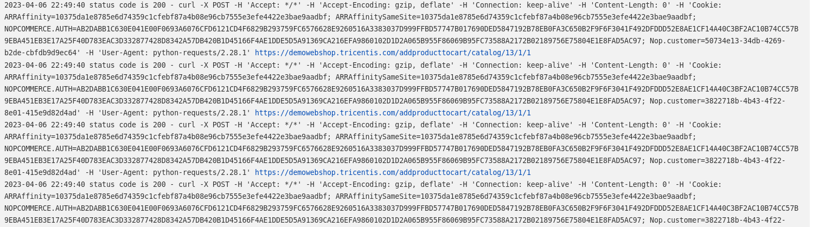

## Проект API автотестов reqres.in
### Используемые технологии

<code></code>
  <code></code>
  <code></code>
  <code></code>
  <code></code>
  <code></code>
  <code></code>
  <code></code>
  <code></code>

  

<!-- Тест кейсы -->

### Что проверяют тесты
API:

WEB:

WEB тесты -  демонстрация гибридных тестов WEB и API.
В WEB тестах используется API для авторизации, создание и удаление сущностей.

В проекте используется встроенный logger - logging:

<!-- Jenkins -->

###  Запуск проекта в Jenkins
### [Job](https://jenkins.autotests.cloud/job/Maxim_Veselov11-reqres-api-tests/)
##### При нажатии на "Собрать сейчас" начнется сборка тестов и их прохождение на сервере jenkins.

Также мы можем посмотреть выполнение тестов в консоли перейдя во вкладку "Вывод консоли" у определенного билда

<!-- Allure report -->

###  Allure report
##### После прохождения тестов, результаты можно посмотреть в Allure отчете, где так же содержится ссылка на Jenkins.

##### Во вкладке Graphs можно посмотреть графики о прохождении тестов, по их приоритезации, по времени прохождения и др.

##### Во вкладке Suites находятся собранные тест кейсы, у которых описаны шаги.

<!-- Telegram -->

###  Интеграция с Telegram
##### После прохождения тестов, в Telegram bot приходит сообщение с графиком и небольшой информацией о тестах.

